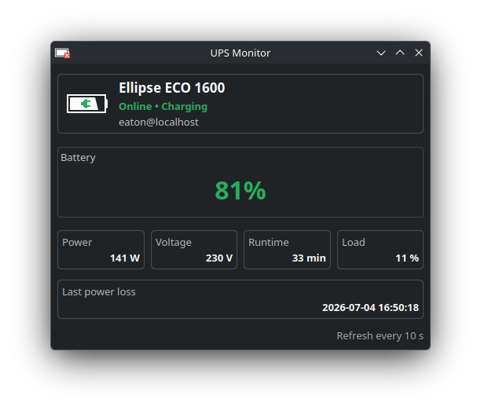

# Plasma UPS Monitor

Plasma 6 widget for monitoring a UPS exposed through NUT (`upsc`).

The widget is built for Plasma Desktop and reads standard NUT fields instead of
talking to vendor-specific software directly. It works best with a local NUT
server, but it can also monitor a remote target if `upsc <name>@<host>` works
on the machine running Plasma.

## Repository

- GitHub: <https://github.com/maku2903/plasma-ups-monitor>

## Screenshot



## Features

- battery percentage
- estimated runtime
- load percentage
- real power in watts when reported by NUT
- output voltage
- raw UPS alarm text
- last detected power-loss timestamp
- configurable refresh interval
- selectable detected local UPS target or manual NUT target entry

## Requirements

- Plasma 6
- `kpackagetool6`
- NUT client tools with `/usr/bin/upsc`
- a reachable NUT target such as `eaton@localhost`
- GNU `date` for local timestamp formatting

## Install

Install from the project directory:

```bash
kpackagetool6 -t Plasma/Applet -i package
```

Update an existing local install:

```bash
kpackagetool6 -t Plasma/Applet -u package
```

Remove it:

```bash
kpackagetool6 -t Plasma/Applet -r io.maciek.plasma.upsmonitor
```

## Download

- latest release: <https://github.com/maku2903/plasma-ups-monitor/releases>
- stable direct zip: <https://github.com/maku2903/plasma-ups-monitor/releases/latest/download/plasma-ups-monitor-latest.zip>
- packaged plasmoid zip: `dist/plasma-ups-monitor-0.2.0.zip`

## Development

Run the widget in a standalone window:

```bash
plasmawindowed io.maciek.plasma.upsmonitor
```

Reinstall the current working copy after changes:

```bash
kpackagetool6 -t Plasma/Applet -u package
```

## Configuration

The widget exposes:

- `UPS name`: a detected local UPS target from `upsc -l`, or any manual NUT target
- `Refresh interval`: polling interval in seconds

Defaults:

- UPS name: `eaton@localhost`
- Refresh interval: `10`

## Notes

- The widget shows what NUT reports. If a driver or UPS firmware exposes
  misleading alarm or status flags, the UI will reflect that.
- Some fields are optional in NUT. If your UPS does not expose wattage,
  runtime, or alarm text, those entries may show `N/A` or remain empty.
- `Last power loss` is tracked locally by the widget helper based on observed
  `OL -> OB` transitions.

## Project Layout

- `package/metadata.json`: Plasma package metadata
- `package/contents/ui/`: QML UI
- `package/contents/scripts/nut-status.sh`: helper that reads NUT and emits JSON
- `CMakeLists.txt`: optional install support for Plasma packaging workflows

## License

MIT. See [LICENSE](LICENSE).
